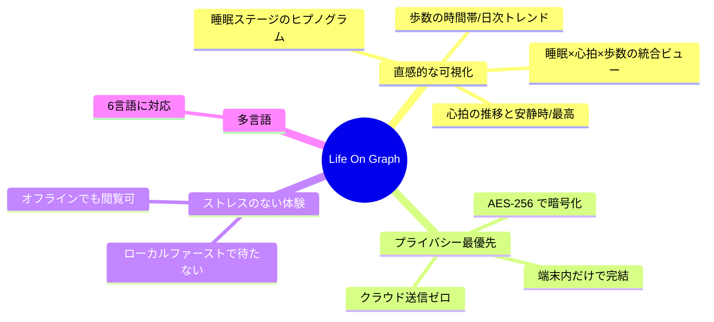
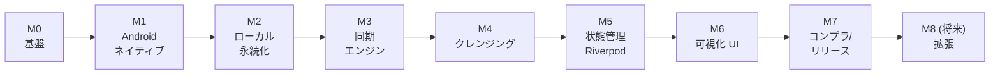

# 01. 企画 (Planning)

## 1.1 出発点となった課題

ウェアラブル端末 (Wear OS / Galaxy Watch / Fitbit / Garmin など) やスマホアプリが
記録した生体データは、Android では **ヘルスコネクト (Health Connect)** に集約される。
しかし多くのユーザーにとって、そこに溜まったデータは「各メーカー純正アプリでバラバラに見る」
ものであり、**睡眠・歩数・心拍を同じ時間軸で横断的に俯瞰する**手段が乏しい。

一方で、健康データは最も機微な個人情報のひとつ。「便利だがデータがどこかのサーバーに
送られる」アプリには心理的な抵抗がある。

> **着想**: ヘルスコネクトを単一の入力源とし、**端末内だけで完結する**シンプルな
> 健康データビューアを作る。「あなたのデータはあなたの端末から出ない」を価値にする。

## 1.2 プロダクトの狙い (バリュープロポジション)

- **直感性**: 数値の羅列ではなく、睡眠ステージ・心拍・歩数を「同じ時間軸」で重ねて見せる。
- **プライバシー**: クラウドを持たない設計そのものを差別化要因にする (後述のセキュリティ章)。
- **即時性**: 起動した瞬間にローカル DB から描画し、同期は裏で走る (待たせない)。

## 1.3 ターゲットユーザー

- すでにウェアラブル/スマホで睡眠・歩数・心拍を記録している Android ユーザー。
- 自分の健康トレンドを「ざっと俯瞰」したいが、データを外部に預けたくない層。
- 複数デバイス/アプリのデータがヘルスコネクトに集まっている人。

## 1.4 スコープの意思決定

「何を作らないか」を最初に決め、機微データのリスクと開発コストを抑えた。

| 含む (初期) | 含まない (将来/別フェーズ) | 判断理由 |
| --- | --- | --- |
| 睡眠・歩数・心拍の取得と可視化 | 体重・血糖・呼吸数など他種別 | 権限を絞ることが審査・信頼の両面で有利 |
| ローカル暗号化永続化 | クラウド同期・バックエンド | プライバシー価値と実装単純化 |
| 読み取り専用 | データ書き込み | 「ビューア」に徹し権限申請を最小化 |
| フォアグラウンド差分同期 | バックグラウンド定期同期 | 省電力・追加権限回避 (まず MVP) |
| Android (Health Connect) | iOS (HealthKit) | `health` パッケージ採用で拡張余地は残す |

> **データ最小化原則**: 申請する権限を「睡眠・歩数・心拍 (+履歴)」に**限定**することは、
> Google Play のヘルス審査でもプライバシー訴求でも有利に働く。最初から欲張らない。

## 1.5 成功条件 (MVP の定義)

1. ヘルスコネクトから 3 種データを取得し、端末内に暗号化保存できる。
2. 起動時にローカルから即描画し、裏で差分同期して自動更新される。
3. 睡眠・歩数・心拍に加え、それらを同一時間軸で重ねた統合ビューを表示できる。
4. データを一切外部送信しない (ネットワーク経路を持たない)。
5. Google Play のヘルス申告・プライバシーポリシー・CASA 要件を満たして公開できる。

## 1.6 マイルストーン設計

GitHub Milestone (M0〜M8) に対応させ、1 タスク = 1 Issue = 1 コミットの粒度で進めた。

各マイルストーンを小さく切ったことで、**AI 駆動開発 (Claude Code) との相性**が良くなった。
「1 Issue を TDD で実装 → CI 緑 → レビュー → マージ」を高速に回せる粒度に保つことが、
人間と AI の協働では特に重要だった (詳細は [04](04_uiux_and_ai.md))。
