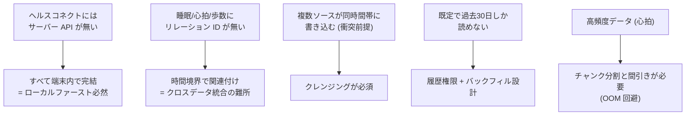

# 02. 要件定義 (Requirements)

一次情報は [`docs/01_requirements.md`](../01_requirements.md)。本章はその要点と、
**なぜその要件にしたか**の判断を補足する。

## 2.1 機能要件 (FR)

| ID | 要件 | 勘所 |
| --- | --- | --- |
| FR-1 | パーミッション管理 | 導入有無検出 → 睡眠/歩数/心拍の READ のみ申請。履歴権限は許可されなければ 30 日にフォールバック |
| FR-2 | データ取得 / 同期 | 初回バックフィル + 差分同期。`uuid` をキーに重複排除。差分極小はスキップ |
| FR-3 | データクレンジング | ソース優先・境界クリップ・オーバーラップ解消・隣接結合 |
| FR-4 | 睡眠可視化 | ステージ積層タイムライン (ヒプノグラム) + 合計/比率集計 |
| FR-5 | 歩数可視化 | 時間帯別/日次・週次・月次 |
| FR-6 | 心拍可視化 | 折れ線 + 「睡眠中心拍」フィルタ |
| FR-7 | クロスデータ統合表示 | 睡眠の時間境界で心拍・歩数を時間軸マッピング |
| FR-8 | ローカルファースト UX | 起動時即描画・オフライン閲覧・同期後リアクティブ更新 |

## 2.2 非機能要件 (NFR)

| ID | 区分 | 要件 |
| --- | --- | --- |
| NFR-1 | セキュリティ | ローカル DB を AES-256 暗号化。鍵は `flutter_secure_storage` で隔離 |
| NFR-2 | プライバシー | ヘルスデータを外部送信・平文ログ出力しない。データ最小化 |
| NFR-3 | パフォーマンス | 起動〜初期描画で待ちを発生させない |
| NFR-4 | 省電力 | 不要な再クエリを避け差分同期で消費を抑制 |
| NFR-5 | 互換性 | Android 9.0+ / 導入有無を判定しフォールバック |
| NFR-6 | 保守性 | レイヤ分離 + TDD |
| NFR-7 | コンプライアンス | Play ヘルス申告・プライバシーポリシー・CASA |

## 2.3 ヘルスコネクト固有の制約 (設計を縛った前提)

ヘルスケアアプリ・ヘルスコネクト開発の「効きどころ」はここに集約される。

- **API レス**: クラウド同期の代わりに、端末ローカルでの差分同期 + 重複排除を自前で設計。
- **関連 ID なし**: 「睡眠中の心拍」は SQL の JOIN ではなく、`t_start ≤ t ≤ t_end` の
  時間フィルタで実現する。これが FR-7 の核心。
- **ソース衝突**: 同じ時間帯を Health Connect 本体・Samsung Health・Fitbit などが
  二重に書く。信頼ソース優先 + オーバーラップ解消で「1 本の真実」に整える。
- **30 日の壁**: `READ_HEALTH_DATA_HISTORY` がなければ権限付与時点から 30 日しか読めない。
  履歴権限の取得と、それでも取れない場合のフォールバックを要件化。
- **高頻度データ**: 常時計測の心拍は 1 日でも数万件。素朴に一括取得すると**メモリ不足
  (OOM) でクラッシュ**する。これは実機検証で顕在化し、設計に反映した ([09](09_topics_and_learnings.md))。

## 2.4 動作要件

| 項目 | 内容 |
| --- | --- |
| OS | Android 9.0 (API 28) 以上 |
| minSdkVersion | 26 |
| compileSdkVersion | 34 |
| ヘルスコネクト | API 34+ はネイティブ統合 / API 33 以下は Play から手動インストール |

## 2.5 要件 → 設計のトレース

| 要件 | 主に応える設計要素 |
| --- | --- |
| FR-2 / NFR-4 | インクリメンタル同期 + `last_sync_time` + 差分スキップ ([03](03_design.md) §同期) |
| FR-3 | クレンジングパイプライン ([03](03_design.md) §クレンジング) |
| FR-7 | 時間境界マッピングによる統合ビュー |
| FR-8 / NFR-3 | ローカル DB 一次ソース + Riverpod 派生プロバイダ |
| NFR-1/2/7 | Hive 暗号化 + secure storage + データ最小化 + コンプライアンス ([07](07_security.md)) |
