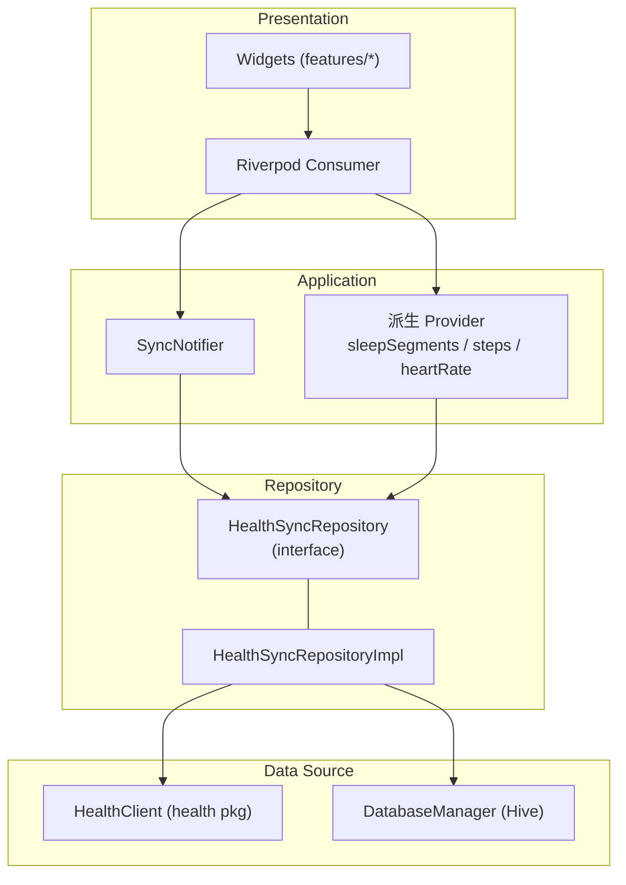
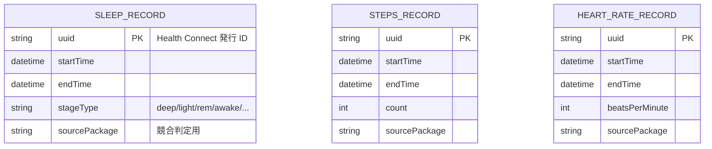
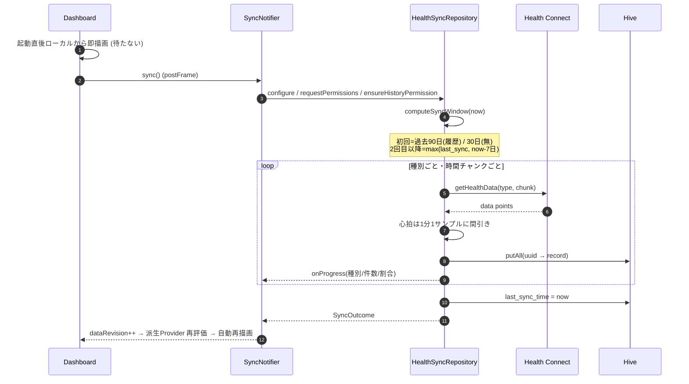
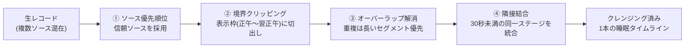
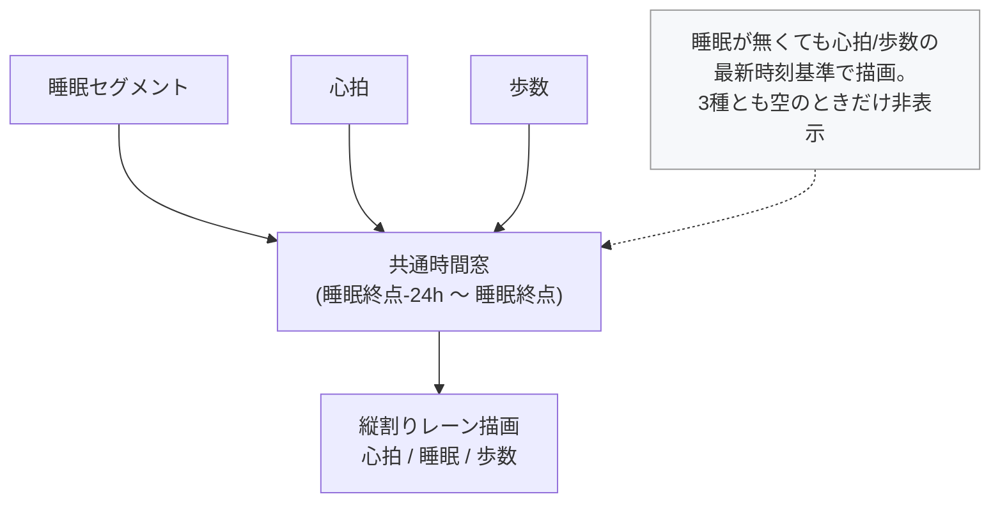
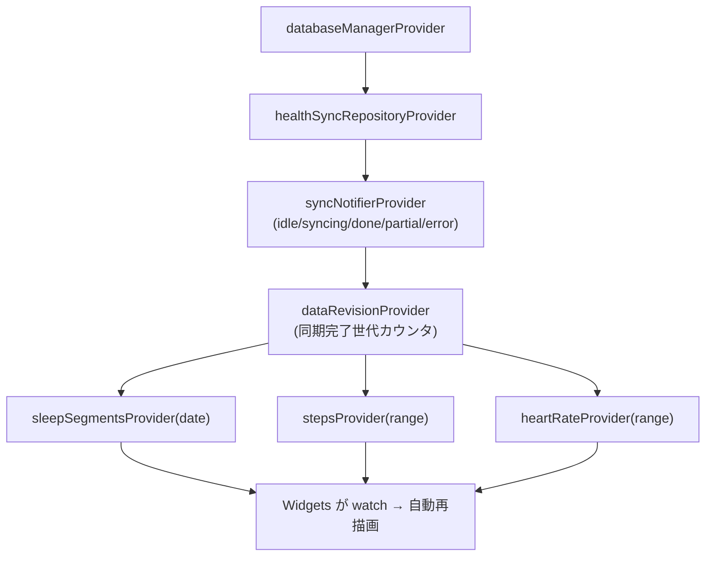

# 03. 設計 (Design)

一次情報は [`docs/02_design.md`](../02_design.md)。本章は図を中心に設計判断を解説する。

## 3.1 レイヤ構成

依存方向は上位 → 下位の一方向。Repository をインタフェース化し、将来のクラウド同期や
iOS 対応でデータソースを差し替えられるようにした。



| レイヤ | 責務 | 主なクラス |
| --- | --- | --- |
| Presentation | UI 描画・操作 | `DashboardView`, `SummaryView`, 各 `*Chart` |
| Application | 状態保持・調整 | `SyncNotifier`, 派生 Provider 群 |
| Repository | 同期・クレンジング・変換 | `HealthSyncRepository` |
| Data Source | 外部 I/O | `HealthClient`(health), `DatabaseManager`(Hive) |

## 3.2 ディレクトリ構成 (実際)

```
lib/
  main.dart            # Hive/SecureStorage 初期化 → runApp、セマンティクス常時 ON
  core/                # DatabaseManager, 暗号鍵, 定数 (AppConstants), 配色
  models/              # Hive モデル (+ *.g.dart 生成物)
  repositories/        # health_sync_repository / cleansing / health_client
  providers/           # Riverpod プロバイダ群
  features/
    splash/ onboarding/ rationale/ tutorial/ lock/   # 導入・権限・チュートリアル・ロック
    dashboard/ sleep/ steps/ heart_rate/ cross_data/  # 可視化
    summary/ calendar/ settings/                      # 期間集計・日付移動・設定
  l10n/                # 6言語 ARB + 生成物
  widgets/             # 共通 UI (capsule_tab_bar 等)
```

## 3.3 データモデル

ヘルスコネクトの `SleepSessionRecord` は「全体セッション」と「ステージ配列」の 2 階層だが、
本アプリは **ステージ単位に正規化**して保存する (二重計上を避けるため `SLEEP_SESSION`
エンベロープは保存対象外)。



- `uuid` を **Hive のキー**にすることで、`Box.put(uuid, record)` の上書きが
  そのまま**重複排除**になる (再同期しても増殖しない)。
- `*.g.dart` アダプタは `build_runner` で生成。

## 3.4 ローカル永続化 (Hive CE)

- 本家 Hive のメンテ停滞を受け、API/オンディスク互換の後継 **Hive CE** を採用
  (新しい analyzer・Flutter 3.44.1 対応)。
- ボックス: `encrypted_sleep_records` / `encrypted_steps_records` /
  `encrypted_heart_rate_records` (いずれも `HiveAesCipher` で **AES-256 暗号化**) +
  `app_sync_metadata` (`last_sync_time` 等の軽量メタ)。
- 暗号鍵は `flutter_secure_storage` (Android Keystore 連携) に base64 保存。未生成時のみ
  `Hive.generateSecureKey()` で生成。鍵はコードにもログにも出さない。
- `DatabaseManager` をシングルトン化し、`main()` の `await initialize()` で開通。

## 3.5 インクリメンタル同期



**設計上の要点**

- **差分の極小スキップ**: 前回同期から 5 分未満ならクエリせず即リターン (省電力)。
- **2 回目以降は過去 7 日上限**: 長期間未起動でも起動時前景同期が重くならないよう、
  差分開始を `max(last_sync, now-7日)` にクランプ。取りこぼした古い履歴は設定の
  「全データ再読み込み」で回収できる退避路を残す。
- **チャンク分割**: 全期間一括取得はメモリを圧迫するため、種別ごとに日数でチャンク化し
  「取得 → 保存 → 解放」を反復。特に**心拍は 1 日チャンク + 1 分間引き**で OOM を回避
  ([09](09_topics_and_learnings.md) のクラッシュ調査参照)。

## 3.6 クレンジングパイプライン

複数ソースが同じ時間帯を二重に書く前提で、読み出し時に整形する。



「唯一のソースしか無い」場合はフェイルオープン (採用) し、データ消失を避ける。

## 3.7 クロスデータ統合 (FR-7)

睡眠・心拍・歩数は関連 ID を持たないため、**睡眠終点を右端とした 24 時間**の共通軸に
3 種をマッピングして 1 画面に重ねる (日中の活動〜夜間の睡眠を俯瞰)。



- 心拍ラインは**データ欠落区間 (10 分超のギャップ) で線を分断**し、空白を直線補間で
  繋がない (孤立点はドット)。誤読を防ぐための UX 配慮 ([04](04_uiux_and_ai.md))。

## 3.8 状態管理 (Riverpod)



- **ローカルファースト**: 派生 Provider はローカル DB から即時取得。同期が**終了した時のみ**
  `dataRevision` をインクリメントし、syncing 中の不要な再走査を避ける。
- `StateProvider` は使わず `Notifier` / `NotifierProvider` に統一 (Riverpod 3)。

## 3.9 エラーハンドリング / フォールバック

| 状況 | 対応 |
| --- | --- |
| ヘルスコネクト未導入 | Play ストアへの導入導線を提示 |
| 権限未許可 | Rationale (機能説明) を表示し再申請導線 |
| 履歴権限なし | バックフィルを過去 30 日に制限 |
| 一部種別の取得失敗 | 成功分は保存・`last_sync_time` は前進させず次回再取得。UI はフォールバック表示 |
