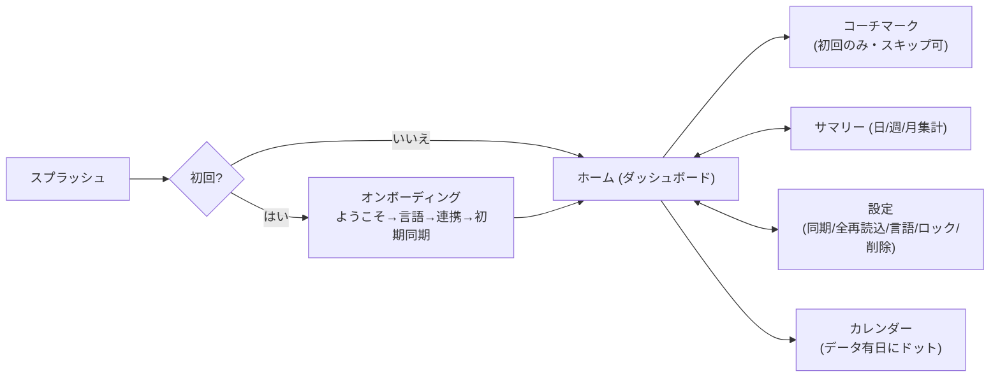
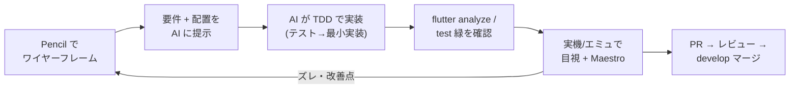

# 04. UI/UX 設計と AI 駆動開発 (Pencil との親和性)

## 4.1 UI/UX の設計方針

ローカルファーストの価値を、画面体験に落とし込むことを重視した。

| 原則 | 具体化 |
| --- | --- |
| **待たせない** | 起動直後にローカル DB から即描画。同期はスピナーで全画面を塞がず、上部の細い進捗バーで「裏で動いている」ことだけ示す |
| **同期が分かる** | 進捗バーに種別 (睡眠/歩数/心拍)・取得件数・割合を 1 行で表示 (「同期しているか分からない」を解消) |
| **誤読させない** | 心拍は欠落区間で線を分断 (空白を補間しない)。睡眠中心拍は「全日/睡眠中」をトグル切替 |
| **俯瞰できる** | 睡眠×心拍×歩数を共通時間軸で重ねた統合ビュー。日/週/月の期間集計 |
| **迷わせない** | 初回はオンボーディングウィザード、ホーム初回はコーチマークで主要操作を案内 (スキップ可) |
| **誰でも使える** | 6 言語対応、生体認証によるアプリロック (任意) |

### 主要画面の構成

ホームは縦スクロールで **睡眠サマリー → 睡眠ステージ → 歩数 → 心拍 → 統合ビュー** を
1 日分まとめて見せる。ボトムタブは `Semantics(identifier:)` を付与し、テキストに依存せず
自動テストから安定して指定できるようにした (→ [06 テスト](06_testing.md))。

## 4.2 Pencil によるワイヤーフレーム

UI は最初からコードで作らず、**Pencil (オープンソースの GUI プロトタイピングツール)** で
ワイヤーフレームを起こした (`designs/m6_visualization.pen` が M6 可視化画面の元案)。

なぜ Pencil か:

- **低コストで速い**: ローカルで動く軽量ツール。Figma のようなオンライン共同編集は不要で、
  個人開発の「素早く形にして検証する」用途に合う。
- **構造が明確**: 画面要素 (カード・グラフ枠・ラベル・タブ) を箱で配置するので、
  「どこに何をどの順で置くか」という**情報設計**が先に固まる。
- **AI への入力に向く**: 配置と意図が視覚的に確定しているため、後述の AI 実装の
  プロンプトに「この配置で」と渡しやすい。

## 4.3 AI 駆動開発との親和性

本プロジェクトは **AI 駆動開発 (Claude Code)** を全面的に活用した。Pencil の
ワイヤーフレームは、その入力として非常に相性が良かった。

うまく回すために効いたこと:

1. **タスクを小さく切る (1 Issue = 1 PR)**: AI は文脈が小さいほど正確。M0〜M7 を
   さらに Issue 粒度に割り、「1 機能を TDD で実装してグリーンにする」単位に保った。
2. **テストを仕様の係留点にする**: 先にテストを書く (TDD) ことで、AI 実装の正しさを
   機械的に検証でき、リグレッションも防げる。曖昧な自然言語仕様の取り違えを減らす。
3. **視覚仕様 (Pencil) + 文章仕様 (docs) + 実行仕様 (test) の三点固定**: 配置は Pencil、
   背景と判断は docs、振る舞いはテスト。AI はこの 3 つを突き合わせてブレずに実装できる。
4. **ガードレールを CI とレビューに置く**: `dart format` / `flutter analyze` / `flutter test`
   を通過しないと配信しない。AI の出力も人間の出力も同じ門を通す。
5. **重要操作は人間が最終承認**: `main` への (= 製品公開に直結する) マージは人間の明示
   承認を必須にした (行動ルール + ブランチ保護)。AI に自動マージさせない (→ [08](08_delivery.md))。

> **学び**: 「AI に丸投げ」ではなく、**人間が情報設計とテストと承認を握り、実装の手数を
> AI に任せる**分担が、品質と速度を両立させた。Pencil のような軽量ワイヤーフレームは
> その「情報設計を先に確定する」工程を安く実現する点で、AI 駆動開発と噛み合う。

## 4.4 UI/UX 上の具体的な工夫 (抜粋)

- **心拍グラフの欠落分断**: `fl_chart` の単一連続ラインは無データ区間も直線補間してしまう。
  10 分超のギャップで `FlSpot.nullSpot` を挟んで線を切り、孤立点はドットで描く。統合ビューと
  単独グラフで挙動・閾値を統一。
- **統合ビューのフォールバック**: 睡眠が無くても心拍/歩数があれば最新時刻基準の 24 時間で
  描画。3 種とも空のときだけ「データなし」。
- **オンボーディングの堅牢化**: オンボーディング完了フラグを**初期同期の前に**永続化し、
  同期中にクラッシュしても再オンボーディングに戻らないようにした。
- **アクセシビリティ**: `main()` で `SemanticsBinding.ensureSemantics()` を呼び、
  セマンティクスを常時有効化 (Maestro が UI 要素を識別できるように)。
