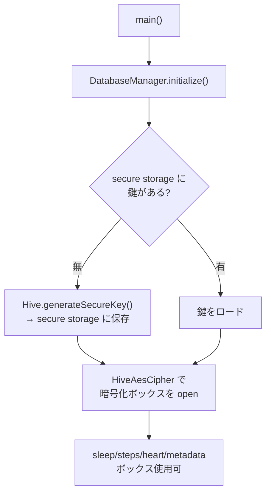

# 05. 実装 (Implementation)

## 5.1 技術スタック

| 領域 | 採用 | バージョン | 理由 |
| --- | --- | --- | --- |
| フレームワーク | Flutter / Dart | 3.44.1 | 単一コードベース・宣言的 UI・将来の iOS 拡張余地 |
| 状態管理 | `flutter_riverpod` | ^3.3.1 | コンパイル時安全・テスト容易・`Notifier` ベース |
| ローカル DB | `hive_ce` | ^2.19.3 | 軽量 KVS。本家 Hive 互換の後継。`HiveAesCipher` で AES-256 |
| 鍵管理 | `flutter_secure_storage` | ^10.3.1 | Android Keystore 連携で鍵を隔離 |
| ヘルス連携 | `health` | ^13.0.0 | デファクト。Health Connect 対応・iOS 拡張余地 |
| 可視化 | `fl_chart` | ^1.2.0 | 折れ線/棒グラフ。睡眠タイムラインは CustomPainter |
| 生体認証 | `local_auth` | ^3.0.1 | アプリロック |
| コード生成 | `build_runner` | ^2.4.13 | Hive アダプタ・l10n |

> バージョンは固定運用。特に Flutter 3.44.1 / Hive CE (本家 Hive 不使用) は前提として重要。

## 5.2 Android ネイティブの勘所

- `minSdkVersion 26` / `compileSdkVersion 34` (Health Connect 要件)。
- `MainActivity` を `FlutterFragmentActivity` に変更 (`registerForActivityResult` ベースの
  権限要求を正しく動かすため)。
- `AndroidManifest.xml`:
  - `<queries>` に `com.google.android.apps.healthdata` と Rationale インテントを宣言。
  - 権限は **READ_SLEEP / READ_STEPS / READ_HEART_RATE / READ_HEALTH_DATA_HISTORY** に限定
    (WRITE・バックグラウンドは申請しない)。歩数取得用に `ACTIVITY_RECOGNITION`、ロック用に
    `USE_BIOMETRIC`。
  - 高頻度心拍の取得でメモリに余裕を持たせるため `android:largeHeap="true"`。
- `versionCode` を **git コミット数 + ベース 100000** から自動採番 (`build.gradle.kts`)。
  ローカル/CI 共通・手動バンプ不要・Play 重複回避。

## 5.3 主要コンポーネントの実装

### DatabaseManager (暗号化 Hive)



- 破損時のリカバリ経路も実装 (open 失敗時のハンドリング)。鍵・データは平文ログに出さない。

### HealthSyncRepository (同期 + クレンジング)

- `computeSyncWindow(now)` で取得窓を決定 (初回=履歴 90 日/無 30 日、2 回目以降=
  `max(last_sync, now-7日)`、設定の全再読込=最大 10 年)。
- `_runCategory(...)` で種別ごとにチャンク分割取得 → `putAll` で保存 → `onProgress` 通知。
- **心拍の間引き**: 1 分あたり 1 サンプル (その分の最古、同時刻は uuid で安定タイブレーク) に
  ダウンサンプルしてから保存。再同期でも同じ代表を選ぶので重複が増えない。
- 読み出しは `getCleanedSleepSegmentsForDay` 等でクレンジングを適用。

### 可視化 (fl_chart + CustomPainter)

- 歩数: 棒グラフ、心拍: 折れ線 (欠落分断 + 孤立点ドット)、睡眠: ステージ積層タイムライン。
- 統合ビュー (`CrossDataChart`): 共通時間窓に 3 種を縦割りレーンで描画する CustomPainter。

## 5.4 特筆すべきエンジニアリング判断

### ① 初期同期の OOM クラッシュ解消 (最重要)

実機 (Pixel, Android 16) の初回同期で**強制終了**。logcat で原因を特定:

```
java.lang.OutOfMemoryError: ... target footprint 268435456 (256MB)
  at ...StandardMessageCodec.writeValue
  at cachet.plugins.health.HealthDataReader$getData(HealthDataReader.kt:127)
```

`health` プラグインが **1 チャンク分の心拍を丸ごとプラットフォームチャネルへ
シリアライズ**する際にヒープ上限を超えていた (Hive でも ANR でもない)。対処:

- **心拍は 1 日チャンク**に細分化 (`heartRateChunkDays = 1`)。
- **1 分 1 サンプルに間引き** (保存量と転送量を圧縮)。
- `largeHeap="true"` でヒープ余裕を確保。

結果、実機で過去 3 か月 (心拍 49,433 件) を**クラッシュなく完走**することを検証。

### ② 2 回目以降の起動同期を 7 日上限に

長期間未起動だと差分窓が巨大化し起動が重い。`max(last_sync, now-7日)` に上限。
これは「30 日読取床への**不本意な**クランプ回避」とは別の**意図的な速度上限**で、
取りこぼした古い履歴は設定の「全データ再読み込み」で回収できる退避路を残した。

### ③ クラッシュ耐性 (再オンボーディング防止)

オンボーディング完了フラグを**同期前に**永続化。同期中にクラッシュしても、再起動時に
言語選択からやり直しにならないようにした。

## 5.5 コーディング規約

- `dart format` + `flutter analyze` (lints) でスタイル統一。公開 API に Dart Doc。
- 機密データはログに出さない (データ最小化)。
- コミットは意味のある単位。`feat:` / `fix:` 規約に沿うとリリースノートに自動集約される。
