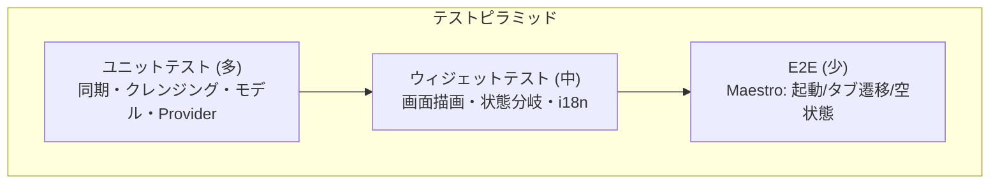
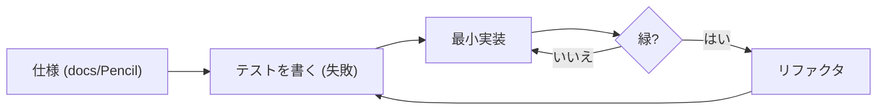

# 06. テスト (Testing)

## 6.1 テスト戦略の全体像

「ロジックは TDD のユニット/ウィジェットで厚く、ユーザー体験は E2E で広く」を方針にした。



- ロジック層 (同期・クレンジング) を中心に **TDD** (テスト先行 → 最小実装)。
- `health` / Hive / secure storage / 生体認証は **フェイクに差し替え**て決定的に検証。
- 配信パイプラインは `dart format` / `flutter analyze` / `flutter test` 通過を**配信の門**にする。

## 6.2 ユニット / ウィジェットテスト

`test/` に約 200+ ケース。フェイクで外部依存を排除する。

| 種別 | 例 |
| --- | --- |
| フェイク | `FakeHealthClient` / `FakeSecureKeyStore` / `FakeBiometricAuth` / `FakeActivityRecognitionPermission` |
| 同期 | 同期窓算出 (初回/差分/7日上限)、チャンク分割、UUID 上書き重複排除、差分スキップ、心拍間引きの決定性 |
| クレンジング | ソース優先・境界クリップ・オーバーラップ解消・隣接結合・削除リコンサイル |
| 永続化 | DatabaseManager 初期化・破損リカバリ・暗号鍵プロバイダ |
| 集計/可視化 | 睡眠サマリー・歩数時間集計・心拍系列・期間集計・統合ビュー窓 |
| UI | ダッシュボード・サマリー・設定・オンボーディング・アプリロック・カレンダー・空状態・i18n |

例: 7 日上限クランプの単体テスト (`test/unit/health_sync_repository_test.dart`) —
60 日前の `last_sync` でも開始が `now - 7日` に切り詰められることを固定する:

```dart
test('差分は過去 recentSyncDays 日を上限に切り詰める (#sync-recent)', () async {
  final now = DateTime(2026, 6, 5, 12);
  final old = now.subtract(const Duration(days: 60));
  await db.metadataBox.put(
    HealthSyncRepositoryImpl.lastSyncTimeKey, old.millisecondsSinceEpoch,
  );
  final window = repo(FakeHealthClient()).computeSyncWindow(now);
  expect(window.start,
      now.subtract(const Duration(days: AppConstants.recentSyncDays)));
});
```

例: 心拍グラフの欠落分断は純粋関数 `buildHeartRateSpots` に切り出し、
「10 分超で `nullSpot` 挿入」「連続では挿入しない」「孤立点を収集」を単体検証している。
欠落区間で線を切る本体側のロジックはこう書ける (`heart_rate_chart.dart`):

```dart
final bool gapBefore = i == 0 ||
    t - sortedPoints[i - 1].startTime.millisecondsSinceEpoch > gapMs; // 10分
if (gapBefore && i > 0) spots.add(FlSpot.nullSpot);   // ← 線を分断
spots.add(FlSpot(x, sortedPoints[i].beatsPerMinute.toDouble()));
```



## 6.3 E2E テスト (Maestro)

ユニット/ウィジェットでは捉えにくい「実機での起動〜画面遷移」を
[Maestro](https://maestro.mobile.dev/) で自動検証する (`.maestro/`)。

| フロー | 検証内容 |
| --- | --- |
| `01_smoke.yaml` | 起動 → 権限ダイアログ許可 (任意) → ボトムタブ [ホーム/サマリー/設定] 表示 |
| `02_navigation.yaml` | タブ遷移 (`tab_home` / `tab_summary` / `tab_settings`) |
| `03_empty_state.yaml` | 当日 (データ無し) の空状態表示 |

### Flutter × Maestro の勘所

- **安定識別子**: ボトムタブに `Semantics(identifier:)` を付与し、表示テキスト
  (i18n で変わる) に依存せず指定できるようにした。
- **セマンティクス常時 ON**: Flutter のセマンティクスツリーは a11y クライアント接続時のみ
  Android のアクセシビリティツリーへ露出される。`main()` で
  `SemanticsBinding.ensureSemantics()` を呼び、Maestro が要素を取得できるようにした。
- **コールドスタート待ち**: デバッグビルドは起動が遅いため、各フロー先頭で
  `extendedWaitUntil` (60s) で初期描画を待つ。

```yaml
# .maestro/flows/01_smoke.yaml (抜粋)
appId: dev.otomo.life_on_graph
---
- launchApp
- tapOn: { text: "すべて許可|許可|Allow all|Allow", optional: true }
- extendedWaitUntil: { visible: "ホーム", timeout: 60000 }
- assertVisible: "サマリー"
- assertVisible: "設定"
```

> 現状はローカル/エミュレータ前提。CI でのエミュレータ起動 or Maestro Cloud 連携は後続検討。

## 6.4 実機検証 (手動 + ログ)

自動テストを補完する形で、実機 (Pixel 10 Pro XL / Android 16) で:

- **オンボーディング通し検証**: スプラッシュ → ようこそ → 言語 → 連携 → 初期同期
  (心拍 49,433 件) → 準備完了 → ホーム到達を、`OutOfMemory`/`FATAL` ゼロで完走確認。
- **logcat による原因特定**: OOM クラッシュの真因 (health プラグインのシリアライズ) を
  スタックトレースから突き止め、設計修正の根拠にした。

実機でしか出ない問題 (高頻度データの OOM、権限ダイアログ、再オンボーディング) は、
**実機 + ログ**でしか捕捉できなかった。自動テストと実機検証の二段構えが効いた。
