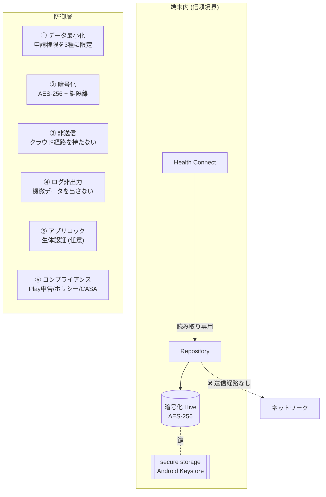
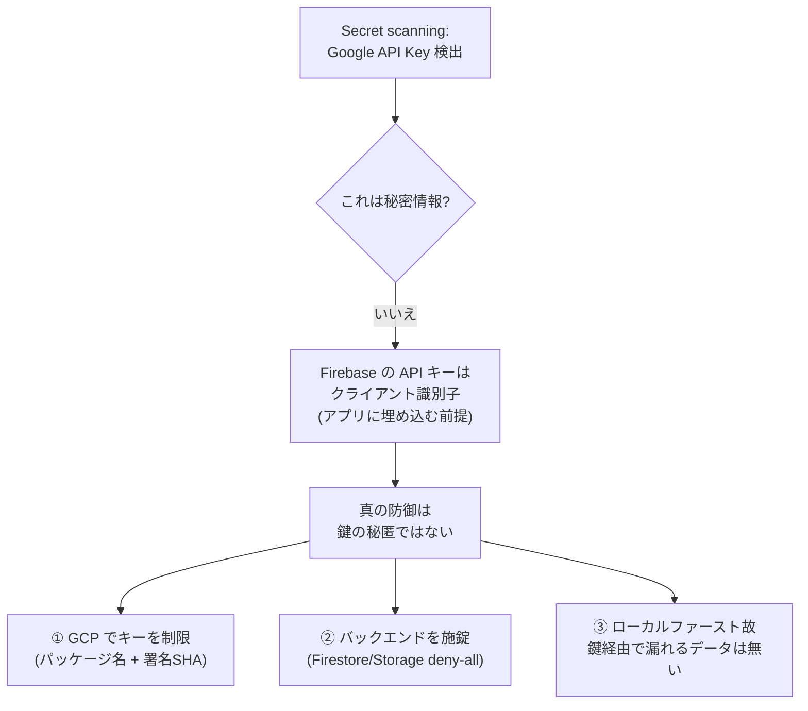

# 07. セキュリティ — データをデバイス内から出さない

本アプリの中核価値は「**ヘルスデータを端末の外に出さない**」こと。設計・実装・運用の
各層でこれを担保する。

## 7.1 多層防御の全体像



## 7.2 各層の中身

### ① データ最小化

申請権限を **3 種 (+ 履歴)** に限定。WRITE もバックグラウンド読み取りも申請しない
(`android/app/src/main/AndroidManifest.xml`):

```xml
<uses-permission android:name="android.permission.health.READ_SLEEP" />
<uses-permission android:name="android.permission.health.READ_STEPS" />
<uses-permission android:name="android.permission.health.READ_HEART_RATE" />
<uses-permission android:name="android.permission.health.READ_HEALTH_DATA_HISTORY" />
<!-- WRITE_* / READ_*_IN_BACKGROUND は申請しない -->
```

- 不要権限の申請は審査却下要因にもなるため、最初から欲張らない。

### ② 暗号化 + 鍵隔離

- ローカル DB (Hive) を `HiveAesCipher` で **AES-256 暗号化**。
- 暗号鍵は `flutter_secure_storage` (Android Keystore 連携) に保存し、コードにも
  リポジトリにもログにも出さない。未生成時のみ `Hive.generateSecureKey()` で生成。

### ③ 非送信 (経路を持たない)

- アプリはヘルスデータを送る**バックエンドを持たない**。Firestore/Auth/Storage は未使用
  (Firebase は `firebase_core` 初期化のみ)。送る先が存在しないことが最大の保証。

### ④ ログ非出力

- 機微データを平文ログに出さない (デバッグログにも含めない)。

### ⑤ アプリロック (任意)

- `local_auth` による生体認証でアプリをロックできる (締め出し回避の配慮込み)。

### ⑥ コンプライアンス

- **Google Play ヘルス申告 (Health Apps Declaration)**: 各権限の用途を説明
  (`docs/compliance/play_health_declaration.md`)。
- **プライバシーポリシー**: 公式サイトと同一ドメインで公開。
- **CASA**: 当面ローカル完結 (外部送信なし) のため Tier 1 (セルフアセスメント) 想定
  (`docs/compliance/casa_tier1_self_assessment.md`)。将来クラウド連携時に Tier 2/3 を検討。
- **データ最小化レビュー**: `docs/compliance/data_minimization_review.md`。

## 7.3 Firebase クライアント鍵の公開検出への対応 (事例)

GitHub Secret Scanning が `firebase_options.dart` 等の **Firebase Android API キー**を
「公開漏洩」として検出した。正しい理解と対応:



- **要点**: Firebase の API キーは「秘密」ではなく「識別子」。セキュリティは
  **キー制限 (アプリ署名 + パッケージ名) + Security Rules + App Check** で担保する。
- 実施: Firestore/Storage を **deny-all ルール**化 (将来誤って有効化しても全拒否)。
  GCP でのキー制限 (パッケージ名 + アップロード鍵/Play 署名鍵の SHA) を案内。

```javascript
// firestore.rules — クライアントからの読み書きを既定で全拒否
rules_version = '2';
service cloud.firestore {
  match /databases/{database}/documents {
    match /{document=**} {
      allow read, write: if false;
    }
  }
}
```
- 本アプリはローカルファーストでバックエンドにヘルスデータを持たないため、この鍵経由で
  漏れるユーザーデータは存在しない (=実害は無い) ことを確認したうえで対処した。

## 7.4 リポジトリ運用上のシークレット管理

- `*.jks` / `key.properties` / SA JSON は `.gitignore` 済み。コミットしない。
- 署名鍵・Play サービスアカウント・Firebase SA は **GitHub Secrets** で管理し、CI が復元する
  (→ [08 デリバリー](08_delivery.md))。
- `main` への (= 公開に直結する) マージは人間の明示承認を必須化 (誤公開の防止)。
