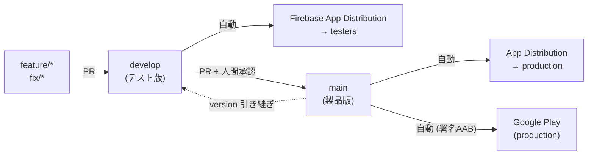
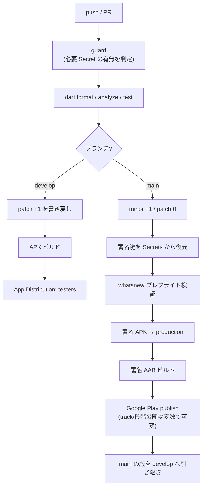
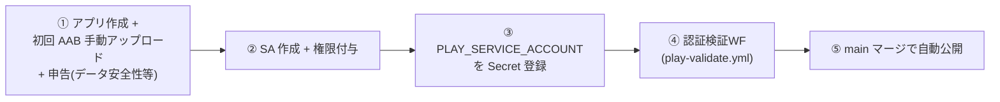
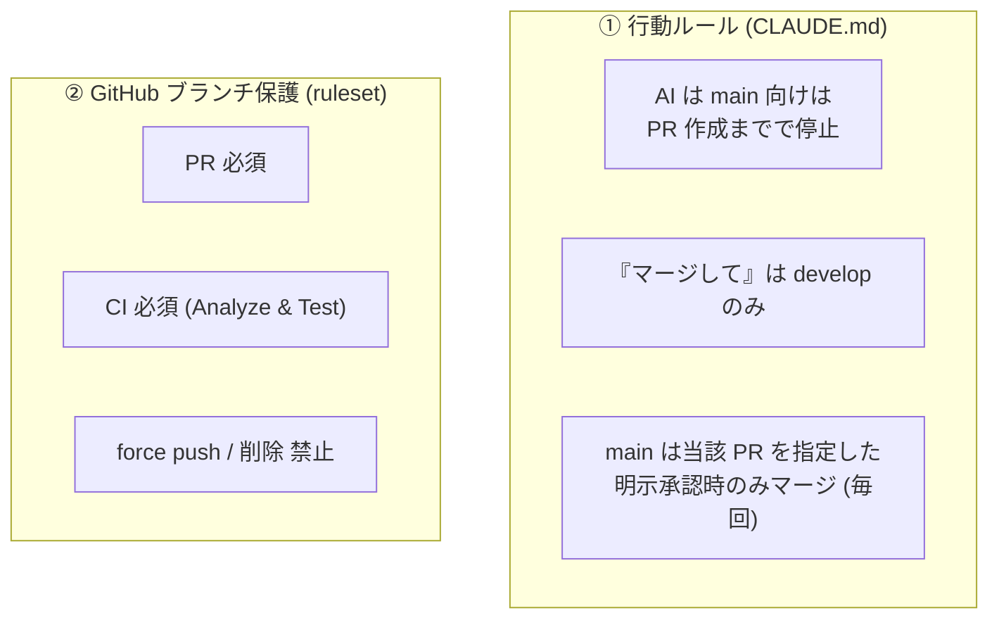

# 08. デリバリー (Delivery) — リリース手順

一次情報は [`docs/release.md`](../release.md)。本章は全体フローを図で俯瞰する。

## 8.1 ブランチ戦略

- 作業ブランチは **`develop` から切り**、PR は **`develop` 向け**。
- `develop` マージ → テスト版 APK を `testers` へ自動配信。
- テスト OK 後に `develop` → **`main`** へ PR。`main` マージ → 製品配信 + Play 公開。
- **`main` マージは人間の明示承認が必須** (後述 §保護)。

## 8.2 CI/CD パイプライン

- **guard ジョブ**: 必要な Secret が未登録の間は該当ジョブをスキップ (設定前の push を
  赤くしない)。`firebase` / `signing` / `play` の 3 段階で有効化される。
- **テスト通過が配信の門**: `dart format` / `flutter analyze` / `flutter test` 緑のときのみ配信。
- **whatsnew プレフライト**: Play 公開前に言語別リリースノートを検証 (上限 500 字 / 必須 6
  ロケール / 空) し fail-fast。

## 8.3 バージョニング (SemVer + 自動採番)

| 契機 | versionName | 例 |
| --- | --- | --- |
| `develop` への push | **PATCH +1** | 1.2.3 → 1.2.4 |
| `main` への push (リリース) | **MINOR +1 / PATCH 0** | 1.2.4 → 1.3.0 |
| リリース後 | main の版を develop へ引き継ぎ | develop も 1.3.0 |

- `versionCode` は **git コミット数 + 100000** から自動採番 (単調増加・手動バンプ不要・
  Play 重複回避)。
- バージョン更新コミットは `[skip ci]` 付きで書き戻し、無限ループを防ぐ。

## 8.4 リリースノート

- **App Distribution**: `tool/release_notes.sh` が git 履歴 (`feat:`/`fix:`) から自動生成。
- **Google Play**: `distribution/whatsnew/whatsnew-<locale>` を言語ごとに管理 (6 言語)。
  `tool/play_release_notes.sh` で言語タグ付き結合テキストも生成できる。

## 8.5 Google Play 自動公開のセットアップ

- Play API は**既存アプリの新リリース**しか作れないため、最初の 1 本と各種申告は手動。
- 公開トラック/段階公開は **Repository variables** (`PLAY_TRACK` / `PLAY_STATUS` /
  `PLAY_USER_FRACTION`) でコード変更なしに切替可能 (internal / 段階 / draft)。
- `play-validate.yml` で SA の API アクセスを**変更を加えずに**検証してから本番に進める。

## 8.6 main 保護 (人間の承認を経たマージのみ)

製品公開に直結する `main` は二層で守る。

> AI は所有者の認証情報で動くため GitHub からは所有者と区別できない。よって**実効的な
> 抑止は①の行動ルール**で、②は「全変更を PR + CI 緑」に強制するガードレールとして併用する。

## 8.7 その他の配信物

- **公式サイト + プライバシーポリシー**: Firebase Hosting に `website/` を main マージで
  自動デプロイ (`deploy-website.yml`)。
- **ストア掲載アセット**: 6 言語のスクリーンショット・説明・フィーチャーグラフィック
  (`docs/store/`)。
