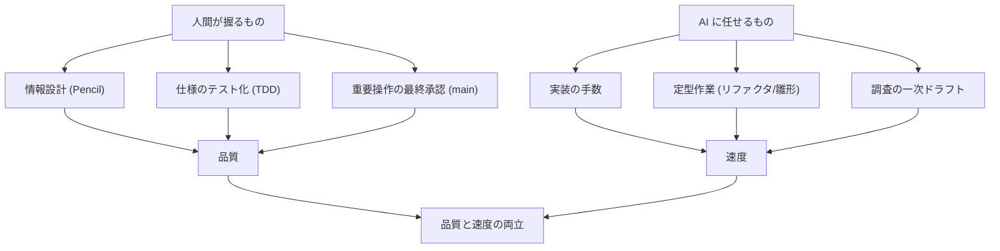

# 09. その他の考慮点と学び

企画〜デリバリーの本流に収まりきらないが、ヘルスケア × Flutter × AI 駆動開発で
**実際に効いた**横断的な考慮点と知見をまとめる。Tech Blog の「ハマりどころ」「Tips」節の素材。

## 9.1 ヘルスコネクト固有のハマりどころ

| 論点 | 実際に起きたこと | 対処 |
| --- | --- | --- |
| 高頻度データの OOM | 心拍の初期同期で実機が強制終了 | 1 日チャンク + 1 分間引き + largeHeap |
| 30 日の壁 | 履歴権限なしだと過去 30 日しか読めない | 履歴権限取得 + フォールバック |
| ソース衝突 | 同時間帯を複数アプリが二重記録 | 信頼ソース優先 + オーバーラップ解消 |
| 関連 ID 不在 | 「睡眠中の心拍」を JOIN できない | 時間境界フィルタで関連付け |
| 導入分岐 | API 34+ はネイティブ / 33 以下は手動導入 | 導入有無検出 + Play 導線 |
| 権限ダイアログ | 自動テストで再現しづらい | 実機検証 + `pm grant` で補完 |

> **教訓**: ヘルスコネクトは「クラウド API のつもりで設計すると破綻する」。
> サーバーレス・関連 ID なし・ソース衝突・高頻度データ、という前提を最初に握ることが肝。

## 9.2 国際化 (i18n) — 6 言語対応

- Flutter 標準の ARB (`lib/l10n/app_<locale>.arb`) で **日英仏独葡西**の 6 言語。
- 端末ロケール追従 + アプリ内での明示切替 (永続化) の両対応。
- UI 文言だけでなく、**ストア掲載文・リリースノート (whatsnew) も 6 言語**で管理。
- 自動テストは表示テキストに依存しない安定識別子 (`Semantics(identifier:)`) を使い、
  i18n でテキストが変わっても壊れないようにした。

## 9.3 オンボーディングと初回体験

- 連携説明で「端末内だけ・READ のみ・暗号化」を明示し、**同意の納得感**を作る。
- 初期同期は件数・割合つきの進捗で「待たされている理由」を可視化。
- 完了フラグを同期前に永続化し、クラッシュ時の再オンボーディングを防止。
- ホーム初回はコーチマークで主要操作を案内 (スキップ可)。

## 9.4 アクセシビリティと自動化の両立

- `SemanticsBinding.ensureSemantics()` で常時セマンティクスを有効化。
  これは**アクセシビリティ**にも**Maestro による自動テスト**にも効く一石二鳥の判断。
- ボトムタブ等の操作要素に安定識別子を付与。

## 9.5 パフォーマンス / 省電力

- ローカルファースト + Riverpod 派生プロバイダで「待たない描画」。
- 差分同期 + 5 分未満スキップ + 7 日上限で、無駄なクエリと電力消費を抑制。
- チャンク分割で同期中のメモリを一定に保つ。

## 9.6 AI 駆動開発の運用知見

- **小さな単位 (1 Issue = 1 PR)** が AI の正確さを引き出す。
- **テスト・CI・レビュー・ブランチ保護**という同じ門を、人間にも AI にも通させる。
- レビュー指摘 (P0/P1/P2 の優先度) を即時/判断付きで回す運用が回転を上げた。
- 実機検証・logcat 解析のような「現場でしか分からないこと」は人間が拾い、設計に反映。

## 9.7 コンプライアンスを"後回しにしない"

- 権限の最小化・プライバシーポリシー・データ安全性申告・ヘルス申告・CASA を、
  リリース直前ではなく**設計段階から要件化** (M7 として明示)。
- ヘルスケアアプリは「機能が動く」だけでは公開できない。**審査要件が実質的な仕様**である、
  という前提でスケジュールに織り込んだ。

## 9.8 今後の拡張 (M8〜)

近期 (UX/i18n 改善)・中期 (バックグラウンド同期・iOS)・長期 (データ種別拡張・ウィジェット)
の計画は **[11. 今後の展望 (Roadmap)](11_roadmap.md)** に独立してまとめた。

---

## まとめ — このプロジェクトの背骨

1. **プライバシーを機能ではなく前提に**: クラウドを持たない設計そのものが価値。
2. **ヘルスコネクトの制約から設計を導く**: サーバーレス・関連 ID なし・高頻度・ソース衝突。
3. **AI 駆動 × TDD × 小さな PR**: 人間が設計と承認、AI が手数。門は同じ。
4. **実機が真実を語る**: OOM も再オンボーディングも、実機 + ログでしか分からなかった。
5. **公開要件は仕様**: コンプライアンスを最初から織り込む。
