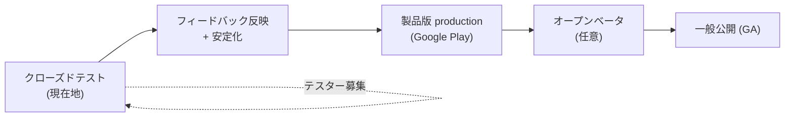
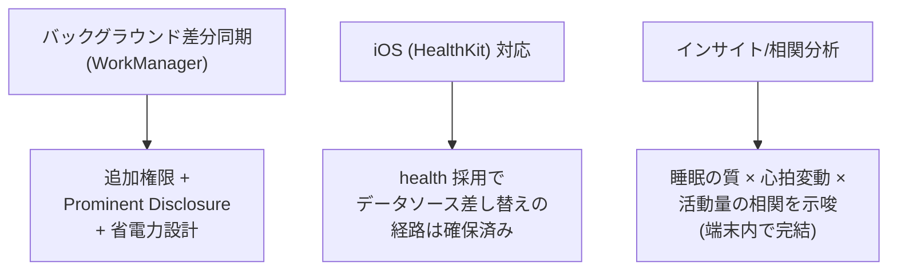
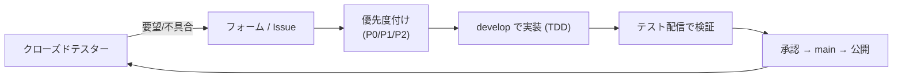

# 11. 今後の展望 (Roadmap)

「ローカルファーストな健康データビューア」という背骨を保ったまま、**体験の深さ**と
**届く範囲**を広げていく。リリースの観点では **クローズドテスト → 製品版 (production)
→ オープンベータ/一般公開** の段階を踏む ([08](08_delivery.md) / [10](10_try_it_and_closed_test.md))。

## 11.1 リリースの段階

- まずクローズドテストで実データ・実端末の多様性に当て、OOM や端末差を潰す。
- `PLAY_STATUS=inProgress` による**段階公開**で、製品版も一気に 100% にせず安全に広げる。

## 11.2 近期 (Now / Next) — 既存 Issue ベース

すでに起票済みの改善。ユーザー要望と運用で見えた穴を埋める。

| 区分 | 項目 | Issue |
| --- | --- | --- |
| UX | 画面全体スワイプで日/週/月を移動 | #146 |
| UX | 心拍グラフにも時刻軸を表示 | #147 |
| 設定 | 表示設定 (テーマ ダーク/ライト/システム・週開始) | #78 |
| i18n | 残りの軽微な UI 文言のローカライズ | #97 |
| i18n | 対応言語の追加 (中国語簡体・韓国語・イタリア語) | #98 |
| i18n | プライバシーポリシー本文の多言語化 | #96 |
| 検証 | 未導入時の Play 導入導線を API 33 以下で目視検証 | #17 |

## 11.3 中期 (Later) — 設計に「余地」を残してある領域

- **バックグラウンド同期 (WorkManager)**: 起動時前景同期に加え、定期的な自動取り込み。
  `READ_*_IN_BACKGROUND` 権限と Google Play の Prominent Disclosure、省電力の両立が前提。
- **iOS (HealthKit) 対応**: `health` パッケージ採用と Repository のインタフェース化により、
  データソースを差し替える形で拡張できる設計になっている ([03](03_design.md))。
- **インサイト**: 単なる可視化から一歩進め、「就寝前の活動と深睡眠の関係」などの示唆を
  **端末内の計算のみ**で提示する (クラウドに出さない原則は維持)。

## 11.4 長期 (Vision)

- **対応データ種別の拡張**: 体重・血中酸素・呼吸数など (都度、権限最小化と審査要件を再確認)。
- **ホーム画面ウィジェット / Wear OS**: 一目で今日のトレンドを見せる。
- **エクスポート (ユーザー主導)**: ユーザー自身の操作でのみ、端末内データを書き出せる
  (あくまでユーザーの所有物を本人が持ち出す形。自動送信はしない)。

## 11.5 技術的な継続テーマ

| テーマ | 継続的にやること |
| --- | --- |
| 信頼性 | 実機マトリクス拡大、OOM/ANR 監視、クラッシュ時の安全な復旧 |
| テスト | Maestro の CI 連携 (エミュレータ起動 or Maestro Cloud) |
| パフォーマンス | 大量データ端末での同期時間・メモリの継続的プロファイル |
| セキュリティ | App Check 導入検討、依存の脆弱性監視、CASA 区分の再評価 |
| AI 駆動開発 | 小さな PR + TDD + レビューの運用を磨き、知見を本ドキュメントへ還流 |

## 11.6 フィードバックがロードマップを動かす

このロードマップは固定ではない。**クローズドテストの声**が優先順位を決める。

→ まずは触ってフィードバックを返してほしい:
**[10. 実際に試す → クローズドテスト](10_try_it_and_closed_test.md)**
