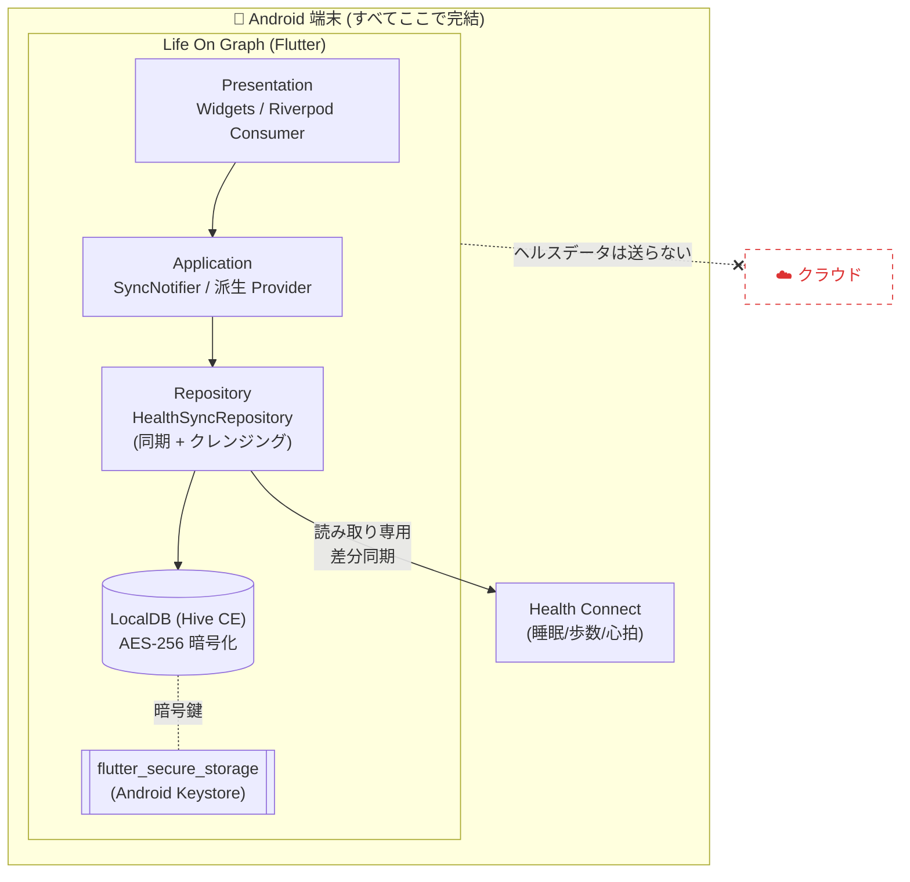
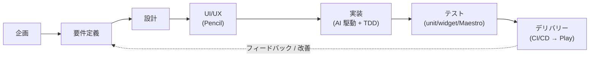

# Life On Graph — 開発ジャーニー

本ディレクトリは、ヘルスケア可視化アプリ **Life On Graph (LOG)** の開発を、
**企画 → 要件定義 → 設計 → 実装 → テスト → デリバリー** のライフサイクルに沿って
言語化したものです。Tech Blog の素材として、各工程の「何を・なぜ・どうやって」を
詳細かつ再利用可能な形で残すことを目的とします。

## プロダクト概要

Android の **ヘルスコネクト (Health Connect)** に集約された **睡眠・歩数・心拍** を取得し、
ユーザーが自身の健康トレンドを直感的に把握できるよう可視化する Flutter 製アプリ。
最大の特徴は **ローカルファースト**:ヘルスデータを**一切クラウドに送らず**、端末内の
暗号化データベースだけで完結させる。

| 項目 | 内容 |
| --- | --- |
| プラットフォーム | Android (Health Connect)。iOS は将来拡張余地を確保 |
| フレームワーク | Flutter 3.44.1 / Dart |
| 主要技術 | Riverpod 3 / Hive CE (AES-256) / health / fl_chart / flutter_secure_storage / local_auth |
| パッケージ名 | `dev.otomo.life_on_graph` |
| 対応言語 | 日本語・英語・フランス語・ドイツ語・ポルトガル語・スペイン語 (6言語) |
| 配信 | Firebase App Distribution (テスト) / Google Play (製品) |

## 大きな観点 (本ジャーニーで扱うテーマ)

- **Android アプリ開発** — minSdk26 / Health Connect ネイティブ統合と手動導入の分岐
- **Flutter による開発** — 単一コードベース・宣言的 UI・コード生成
- **ヘルスケアアプリの開発** — 機微データの扱い・審査・コンプライアンス
- **ヘルスコネクトの開発** — サーバー API 不在・差分同期・データクレンジング
- **UI/UX 設計** — ローカルファースト UX・睡眠×心拍×歩数の統合ビュー
- **Pencil 導入と AI 駆動開発との親和性** — 低コストなワイヤーフレームを AI 実装の入力にする
- **テスト手法 (Maestro)** — ユニット/ウィジェット TDD + Maestro による E2E
- **デバイス外にデータを出さないセキュリティ** — 暗号化・鍵隔離・データ最小化
- **アプリリリース手順** — ブランチ戦略・CI/CD・SemVer・Play 自動公開

## ドキュメント構成

| # | ドキュメント | 内容 |
| --- | --- | --- |
| 01 | [企画 (Planning)](01_planning.md) | 課題・狙い・ターゲット・スコープの意思決定 |
| 02 | [要件定義 (Requirements)](02_requirements.md) | 機能要件 / 非機能要件 / 制約 |
| 03 | [設計 (Design)](03_design.md) | レイヤ構成・データモデル・同期・クレンジング |
| 04 | [UI/UX 設計と AI 駆動開発](04_uiux_and_ai.md) | Pencil ワイヤーフレーム → AI 実装の流れ |
| 05 | [実装 (Implementation)](05_implementation.md) | Flutter/Dart の実装詳細と技術的勘所 |
| 06 | [テスト (Testing)](06_testing.md) | TDD・フェイク・Maestro E2E |
| 07 | [セキュリティ (Security)](07_security.md) | ローカルファースト・暗号化・コンプライアンス |
| 08 | [デリバリー (Delivery)](08_delivery.md) | ブランチ戦略・CI/CD・Play リリース |
| 09 | [その他の考慮点と学び](09_topics_and_learnings.md) | i18n・アプリロック・OOM 対処・知見 |

> 一次情報は [`docs/01_requirements.md`](../01_requirements.md) /
> [`docs/02_design.md`](../02_design.md) / [`docs/03_tasks.md`](../03_tasks.md) /
> [`docs/release.md`](../release.md) / [`docs/compliance/`](../compliance/) にもある。
> 本ジャーニーはそれらを工程横断で再編集し、背景と判断理由を補ったもの。

## 全体像 (アーキテクチャ)

## 開発ライフサイクル

